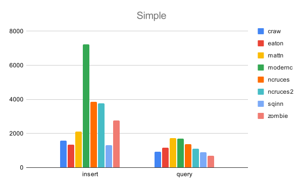
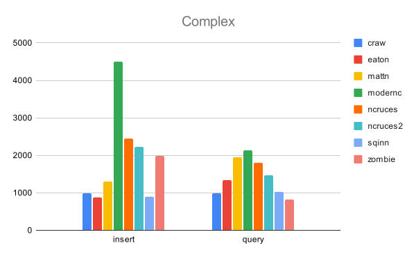
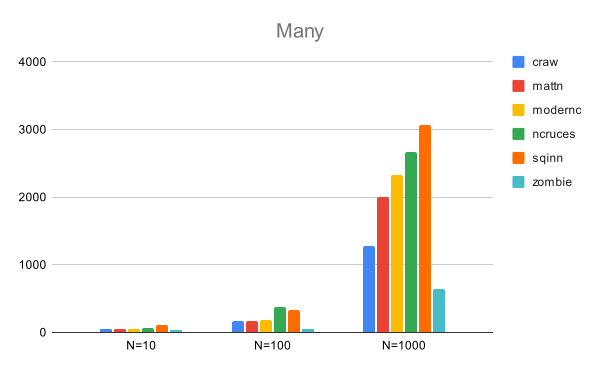
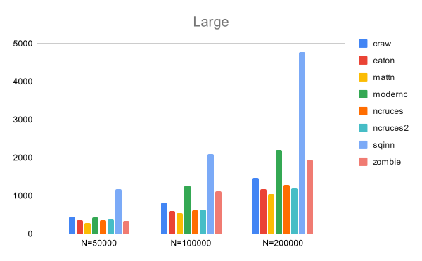
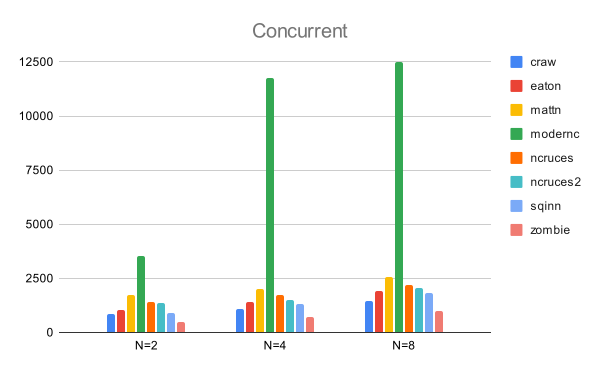

Benchmarks for Golang SQLite Drivers
==============================================================================

This work is sponsored by Monibot - Easy Server and Application Monitoring.
Try out Monibot at [https://monibot.io](https://monibot.io?ref=go-sqlite-bench).
It's free.

For benchmarks I used the following libraries:

- craw, `crawshaw.io/sqlite`, a CGO-based solution. This is not a `database/sql` driver.

- mattn, `github.com/mattn/go-sqlite3`, a CGO-based solution. This library is
  (still) the de-facto standard and widely used. 

- modernc, `modernc.org/sqlite`, a pure Go solution. This is a newer library,
  based on the SQLite C code re-written in Go.

- ncruces, `github.com/ncruces/go-sqlite3`, a pure Go solution based on WASM (?). 

- sqinn, `github.com/cvilsmeier/sqinn-go`, a solution without CGO. It uses
  `github.com/cvilsmeier/sqinn` to access SQLite database files.

- zombie, `github.com/zombiezen/go-sqlite`, a rewrite of the crawshaw driver, using the
  modernc libraries. This is not a `database/sql` driver.

The test setup is as follows:

- OS: Debian/GNU Linux amd64 version 12.3
- CPU: 11th Gen Intel(R) Core(TM) i7-1165G7 @ 2.80GHz, 4 physical cores, 8 logical cores
- RAM: 16GB
- Disk: 1TB NVME SSD
- go version go1.21.5 linux/amd64

The benchmark was run on 2023-12-09, with then-current library versions.
See go.mod for library versions. Each test was run once for warmup.
The second run was then recorded.

A general note on benchmarks:

Do not trust benchmarks, write your own. This specific benchmark is modelled
after my very own database usage scenarios. Your scenarios may be totally
different.

Database Schema
------------------------------------------------------------------------------

The test database consist of the following tables and indizes:

    PRAGMA journal_mode=DELETE;
    PRAGMA synchronous=FULL;
    PRAGMA foreign_keys=1;
    PRAGMA busy_timeout=5000;

    CREATE TABLE users (
        id INTEGER PRIMARY KEY NOT NULL,
        created INTEGER NOT NULL,
        email TEXT NOT NULL,
        active INTEGER NOT NULL);
    CREATE INDEX users_created ON users(created);

    CREATE TABLE articles (
        id INTEGER PRIMARY KEY NOT NULL,
        created INTEGER NOT NULL,  
        userId INTEGER NOT NULL REFERENCES users(id),
        text TEXT NOT NULL);
    CREATE INDEX articles_created ON articles(created);
    CREATE INDEX articles_userId ON articles(userId);

    CREATE TABLE comments (
        id INTEGER PRIMARY KEY NOT NULL,
        created INTEGER NOT NULL,
        articleId INTEGER NOT NULL REFERENCES articles(id),
        text TEXT NOT NULL);
    CREATE INDEX comments_created ON comments(created);
    CREATE INDEX comments_articleId ON comments(articleId);

Benchmarks
------------------------------------------------------------------------------

Result times are measured in milliseconds. Lower numbers indicate better
performance.

### Simple

Insert 1 million user rows in one database transaction.
Then query all users once.

                      insert        query
    -------------------------------------
    craw             1622 ms       908 ms
    mattn            2035 ms      1851 ms
    modernc          7218 ms      1851 ms
    ncruces          4706 ms      1959 ms
    sqinn            1337 ms       927 ms
    zombie           2623 ms       584 ms

### Complex

Insert 200 users in one database transaction.
Then insert 20000 articles (100 articles for each user) in another transaction.
Then insert 400000 comments (20 comments for each article) in another transaction.
Then query all users, articles and comments in one big JOIN statement.

                       insert       query
    -------------------------------------
    craw              1011 ms      972 ms
    mattn             1231 ms     2047 ms
    modernc           4414 ms     2290 ms
    ncruces           2985 ms     2577 ms
    sqinn              911 ms     1068 ms
    zombie            2187 ms      858 ms

### Many

Insert N users in one database transaction.
Then query all users 1000 times.
This benchmark is used to simluate a read-heavy use case.

            query/N=10  query/N=100  query/N=1000
    --------------------------------------------------------
    craw         58 ms       168 ms       1282 ms
    mattn        52 ms       165 ms       2003 ms
    modernc      58 ms       186 ms       2335 ms
    ncruces      73 ms       375 ms       2665 ms
    sqinn       112 ms       331 ms       3071 ms
    zombie       34 ms        58 ms        646 ms

### Large

Insert 10000 users with N bytes of row content.
Then query all users.
This benchmark is used to simluate reading of large (gigabytes) databases.

          query/N=50000  query/N=100000  query/N=200000
    ---------------------------------------------------
    craw         429 ms          784 ms         1639 ms
    mattn        308 ms          624 ms         1098 ms
    modernc      599 ms         1054 ms         1983 ms
    ncruces      395 ms          678 ms         1271 ms
    sqinn       1269 ms         2553 ms         5707 ms
    zombie      1064 ms         2057 ms         4115 ms

### Concurrent

Insert one million users.
Then have N goroutines query all users.
This benchmark is used to simulate concurrent reads.

            query/N=2  query/N=4  query/N=8
    ---------------------------------------
    craw       796 ms    1145 ms    1553 ms
    mattn     1782 ms    2019 ms    2642 ms
    modernc   3554 ms   10789 ms   39959 ms
    ncruces   2075 ms    2321 ms    3203 ms
    sqinn      910 ms    1327 ms    1965 ms
    zombie     509 ms     777 ms    1054 ms

Summary
------------------------------------------------------------------------------

- We cannot declare a winner, it all depends on the use case.
- Crawshaw and Zombiezen are pretty fast.
- Mattn, although the de-facto standard, is not the best overall solution.
- SQLite without CGO is possible.

This work is sponsored by Monibot - Easy Server and Application Monitoring.
Try out Monibot at [https://monibot.io](https://monibot.io?ref=go-sqlite-bench).
It's free.
