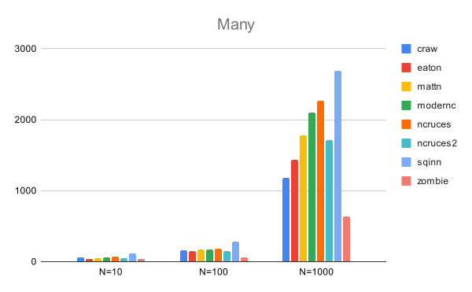

Benchmarks for Golang SQLite Drivers
==============================================================================

> [!IMPORTANT]
> I noticed my SQLite driver [`github.com/ncruces/go-sqlite3`](https://github.com/ncruces/go-sqlite3)
> was doing poorly in this benchmark that got posted on [Hacker News](https://news.ycombinator.com/item?id=38626698)
> and [reddit](https://www.reddit.com/r/golang/comments/18hgbyl/i_benchmarked_six_go_sqlite_drivers_and_found_you/).
>
> I traced it back to a [new feature](https://github.com/ncruces/go-sqlite3/commit/c667a1f469f28879a044807f8ed83e36645977ba),
> and a serious [performance regression](https://github.com/ncruces/go-sqlite3/commit/d862f47d95d522fb7a63aacf1259714aff986d46)
> (introduced to fix a compiler crash).\
> I implemented a [fix](https://github.com/ncruces/go-sqlite3/commit/964a42c76deb9c7dcff2dca5c19f0453e062c55f)
> (a 4x larger, PLRU bit cache), released a new version, and ran the numbers again (different machine, configuration).
>
> **The results of the new experiment are below**.

This work is sponsored by Monibot - Easy Server and Application Monitoring.
Try out Monibot at [https://monibot.io](https://monibot.io?ref=go-sqlite-bench).
It's free.

For benchmarks I used the following libraries:

- craw, `crawshaw.io/sqlite`, a CGO-based solution.
  This is not a `database/sql` driver.

- eaton, `github.com/eatonphil/gosqlite`, a CGO-based solution.
  This is not a `database/sql` driver. (addded by @c4rlo)

- mattn, `github.com/mattn/go-sqlite3`, a CGO-based solution.
  This library is (still) the de-facto standard and widely used.

- modernc, `modernc.org/sqlite`, a pure Go solution.
  This is a newer library, based on the SQLite C code re-written in Go.

- ncruces, `github.com/ncruces/go-sqlite3/driver`, a pure Go solution based on WASM.

- ncruces2, `github.com/ncruces/go-sqlite3`, a pure Go solution based on WASM.
  This is not a `database/sql` driver.

- sqinn, `github.com/cvilsmeier/sqinn-go`, a solution without CGO.
  It uses `github.com/cvilsmeier/sqinn` to access SQLite database files.

- zombie, `github.com/zombiezen/go-sqlite`, a rewrite of the crawshaw driver,
  using the modernc libraries. This is not a `database/sql` driver.

The test setup is as follows:

- OS: Debian GNU/Linux rodete
- CPU: Intel(R) Xeon(R) W-2135 CPU @ 3.70GHz
- RAM: 64GB
- Disk: 512 NVME SSD
- go version go1.22.4 linux/amd64

The benchmark was run on 2024-06-21, with then-current library versions.
See go.mod for library versions. Each test was run once for warmup.
The second run was then recorded. This is not very scientific.

A general note on benchmarks:

Do not trust benchmarks, write your own. This specific benchmark is modelled
after my very own database usage scenarios. Your scenarios may be totally
different.

Database Schema
------------------------------------------------------------------------------

The test database consist of the following tables and indizes:

    PRAGMA journal_mode=DELETE;
    PRAGMA synchronous=FULL;
    PRAGMA foreign_keys=1;
    PRAGMA busy_timeout=5000;

    CREATE TABLE users (
        id INTEGER PRIMARY KEY NOT NULL,
        created INTEGER NOT NULL,
        email TEXT NOT NULL,
        active INTEGER NOT NULL);
    CREATE INDEX users_created ON users(created);

    CREATE TABLE articles (
        id INTEGER PRIMARY KEY NOT NULL,
        created INTEGER NOT NULL,
        userId INTEGER NOT NULL REFERENCES users(id),
        text TEXT NOT NULL);
    CREATE INDEX articles_created ON articles(created);
    CREATE INDEX articles_userId ON articles(userId);

    CREATE TABLE comments (
        id INTEGER PRIMARY KEY NOT NULL,
        created INTEGER NOT NULL,
        articleId INTEGER NOT NULL REFERENCES articles(id),
        text TEXT NOT NULL);
    CREATE INDEX comments_created ON comments(created);
    CREATE INDEX comments_articleId ON comments(articleId);

Benchmarks
------------------------------------------------------------------------------

Result times are measured in milliseconds. Lower numbers indicate better
performance.

### Simple

Insert 1 million user rows in one database transaction.
Then query all users once.

                      insert        query
    -------------------------------------
    craw             1576 ms       943 ms
    eaton            1331 ms      1167 ms
    mattn            2120 ms      1727 ms
    modernc          7229 ms      1689 ms
    ncruces          3853 ms      1387 ms
    ncruces2         3783 ms      1104 ms
    sqinn            1327 ms       906 ms
    zombie           2767 ms       690 ms

### Complex

Insert 200 users in one database transaction.
Then insert 20000 articles (100 articles for each user) in another transaction.
Then insert 400000 comments (20 comments for each article) in another transaction.
Then query all users, articles and comments in one big JOIN statement.

                       insert       query
    -------------------------------------
    craw               991 ms      988 ms
    eaton              869 ms     1341 ms
    mattn             1295 ms     1943 ms
    modernc           4493 ms     2131 ms
    ncruces           2455 ms     1796 ms
    ncruces2          2222 ms     1474 ms
    sqinn              887 ms     1028 ms
    zombie            1990 ms      826 ms

### Many

Insert N users in one database transaction.
Then query all users 1000 times.
This benchmark is used to simluate a read-heavy use case.

            query/N=10  query/N=100  query/N=1000
    ---------------------------------------------
    craw         57 ms       156 ms       1185 ms
    eaton        43 ms       152 ms       1437 ms
    mattn        49 ms       166 ms       1782 ms
    modernc      56 ms       168 ms       2100 ms
    ncruces      68 ms       179 ms       2272 ms
    ncruces2     45 ms       146 ms       1713 ms
    sqinn       116 ms       285 ms       2686 ms
    zombie       34 ms       59	 ms        638 ms

### Large

Insert 10000 users with N bytes of row content.
Then query all users.
This benchmark is used to simluate reading of large (gigabytes) databases.

          query/N=50000  query/N=100000  query/N=200000
    ---------------------------------------------------
    craw         456 ms          813 ms         1477 ms
    eaton        365 ms          598 ms         1175 ms
    mattn        284 ms          541 ms         1037 ms
    modernc      430 ms         1274 ms         2214 ms
    ncruces      354 ms          622 ms         1287 ms
    ncruces2     369 ms          634 ms         1215 ms
    sqinn       1173 ms         2093 ms         4779 ms
    zombie       335 ms         1123 ms         1955 ms

### Concurrent

Insert one million users.
Then have N goroutines query all users.
This benchmark is used to simulate concurrent reads.

            query/N=2  query/N=4  query/N=8
    ---------------------------------------
    craw       861 ms    1098 ms    1442 ms
    eaton     1033 ms    1397 ms    1909 ms
    mattn     1734 ms    2011 ms    2559 ms
    modernc   3513 ms   11769 ms   62032 ms
    ncruces   1415 ms    1722 ms    2211 ms
    ncruces2  1378 ms    1484 ms    2041 ms
    sqinn      903 ms    1337 ms    1844 ms
    zombie     475 ms     719 ms     990 ms

Summary
------------------------------------------------------------------------------

- We cannot declare a winner, it all depends on the use case.
- Crawshaw and Zombiezen are pretty fast.
- SQLite without CGO is possible.

This work is sponsored by Monibot - Easy Server and Application Monitoring.
Try out Monibot at [https://monibot.io](https://monibot.io?ref=go-sqlite-bench).
It's free.
